# 介绍

[点击查看链接版思维导图](./stack.svg)

> 尽量脱离编程语言，以伪代码的形式阐述后端知识点。

1. 在线文档: [be.nimo.run](https://be.nimo.run)
2. 在线视频: [https://space.bilibili.com/252027563](https://space.bilibili.com/252027563)

参考书籍:

1. [数据密集型应用系统设计
   ](https://book.douban.com/subject/30329536/)
 
