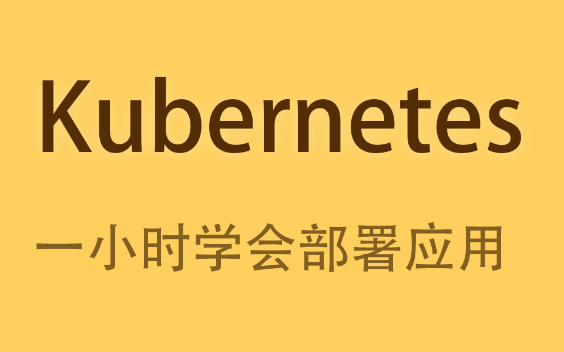

# 一个小时学会Kubernetes部署应用

<div style="color:red">在腾讯云新建kunernetes 集群的版本一定要选择 1.18.4,选择其他版本可能会导致 kubesphere 无法安装</div>

**快速跳转:**

1. [安装 KubeSphere 命令](#ks-install)

> 1. **摒弃复杂概念**,不是运维也能看懂的教程
> 2. 只需了解简单的**表单操作**便可轻松部署项目

> 本教程注重实践,如果只是看一遍不操作依然还是一学就会,一用就废.
> 讲稿: https://be.nimo.run/ops/k8s
> Github: https://github.com/nimoc/be/discussions/4

课程介绍视频:

[点击播放 ](https://www.bilibili.com/video/BV1cL4y167GV)

## 初学难点 <a id="difficulty"></a>

1. 安装

2. yaml创建资源

3. 负载均衡和网络

### 安装 <a id="install"></a>

**minikube** k8s本机环境安装时候可能会遇到一些问题,WIndows/Mac 平台或多或少会遇到一些问题.并且学习k8s必须理解主机节点和网络相关知识,导致最终还是需要有一个真实的k8s环境.

**k8s集群环境**的安装也有很多限制要求,也可能折腾了一整天才安装完成.

所以建议使用云平台**一键安装按时付费**的k8s集群环境

### yaml创建资源<a id="yaml-create"></a>

与 yaml 为主线来学习 k8s 对于新手入门不友好,记不住,写错配置都会产生挫败感.

通过 kubesphere 直观的感受k8s,混个面熟之后再去了解 yaml 配置文件.

### 负载均衡和网络 <a id="lb-net"></a>

k8s 在网络层面需要云服务商配合使用,很多教程在这方面一带而过,

但是在生产环境使用k8s必须了解这些知识.

*介绍 ingress 应用路由的官方文档*

本教程会基于公有云平台使用负载均衡和应用路由,并使用NAT网关来控制节点统一IP

## 腾讯云安装 TKE<a id="tke-install"></a>


安装k8s视频: https://www.bilibili.com/video/BV1cL4y167GV?p=2


*登录腾讯云安装 TKE 选择2台最低配置的节点,并提现工作环境最少3台节点每台2核4G.*

### 腾讯云删除 TKE 集群<a id="tke-remove"></a>

当你不在使用集群时,记得删除集群以避免扣费

## 安装 KubeSphere <a id="ks-install"></a>

安装k8s视频: https://www.bilibili.com/video/BV1cL4y167GV?p=3

https://kubesphere.io

<div style="color:red">在腾讯云新建kunernetes 集群的版本一定要选择 1.18.4,选择其他版本可能会导致 kubesphere 无法安装</div>

```shell
# 登录节点(替换ip为你的节点ip)
ssh root@20.205.243.166

# 因为 github 有时候很慢没所以我直接把配置文件上传到了 be.nimo.run
# 安装KubeSphere
wget https://nimoc.gitee.io/be/ops/k8s_file/ks/v3.1.1/kubesphere-installer.yaml
# 如果 wget 一直无法成功,你可以
# 1. 直接访问上面的url
# 2. 复制内容
# 3. 在终端输入 vi kubesphere-installer.yaml (记得用 vi 不要用 vim)
# 4. 在终端输入 i 进入编辑模式
# 5. 粘贴
# 6. 输入 :wq
# 7. 回车   

kubectl apply -f kubesphere-installer.yaml

# 下载集群配置 (这个配置文件我已经修改过 pvc 10g 你可以不用修改了)
wget https://nimoc.gitee.io/be/ops/k8s_file/ks/v3.1.1/cluster-configuration.yaml
kubectl apply -f cluster-configuration.yaml

# 查看安装情况
kubectl logs -n kubesphere-system $(kubectl get pod -n kubesphere-system -l app=ks-install -o jsonpath='{.items[0].metadata.name}') -f

# 访问管理页面
http://{你的节点公网IP}:30880
# 用户名 admin 密码 P@88w0rd
```

> 一定要logs输出下面的提示再进行登录

```shell
#####################################################
###              Welcome to KubeSphere!           ###
#####################################################

Console: http://172.17.0.11:30880
Account: admin
Password: P@88w0rd
```


## 使用 Coding 发布镜像<a id="coding-docker"></a>

使用coding发布镜像: https://www.bilibili.com/video/BV1cL4y167GV?p=4

1. *演示Coding* 如何创建代码仓库和发布镜像(代码直接导入github.com/nimoc/echo)
2. 将 Docker 秘钥在 KubeSphere 上添加到 k8s中


## 部署应用<a id="deploy-app"></a>


部署应用视频: https://www.bilibili.com/video/BV1cL4y167GV?p=5

Docker: 容器,我们的应用运行在容器中.**正方形**

Volume: 磁盘卷,用于存储配置文件或数据文件

Pod: 容器组,一个Pod可以有多个Docker

Node: 节点(服务器),Node中可以有多个Pod

*创建多个节点,说明节点在不同的节点上*

## Service


Service和NAT网关视频: https://www.bilibili.com/video/BV1cL4y167GV?p=6

## Service NodePort<a id="service-nodeport"></a>

>  NodePort 节点端口

Service NodePort 使用 节点(服务器) 的端口作为入口供客户端访问应用

****

## Service Load Balancer<a id="service-lb"></a>

> Load Balancer 负载均衡

负载均衡:为将**流量**(负载)**转发**(均衡)给应用

## Service Ingress<a id="service-ingress"></a>

> Ingress 入口/应用路由

文字语言都难以表达 Ingress 是什么,必须通过演示才能说明 Ingress 是什么.

## ConfigMap<a id="config-map"></a>

基本上每个项目都会有配置文件,而配置文件在k8s中通过ConfigMap配置后挂载到应用中

*说明有些场景如果不使用子路径会遇到坑*

## Service ClusterIP<a id="service-cluster-ip"></a>

> ClusterIP 集群IP

有些应用是只允许内网访问,此时可以使用 ClusterIP

 *部署redis-dp和redis-svc,并说明生产环境建议使用云服务*


## NAT 网关

使用 k8s 后所有的不同的节点访问外网时IP是不同的,这不利于在一些第三方平台设置IP白名单.

在腾讯云私有网络路由表 https://console.cloud.tencent.com/vpc/route 添加 NAT 网关

*通过在节点(服务器)运行 `curl https://httpbin.org/ip` 演示IP是不同的*


## 总结

总结视频: https://www.bilibili.com/video/BV1cL4y167GV?p=7

如果想深入了解 k8s 建议看杨波的教程:

https://www.bilibili.com/video/BV1Ja4y1x748
